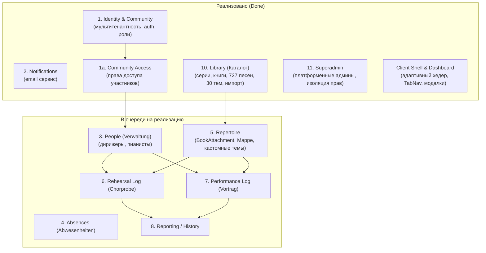

# Chor-App — Центральная документация проекта

**Chor-App** — веб-платформа для управления репертуаром, расписанием репетиций и выступлений церковных и академических хоров.

Проект заменяет исторический одностраничный прототип на HTML/JS/Excel ([`chor-app_v3.html`](file:///Users/alex/Desktop/apps/chor_app/chor-app-docs/chor-app_v3.html)) современной клиент-серверной архитектурой с поддержкой многопользовательского режима, изоляции сообществ (мультитенантности) и глобального каталога печатных изданий.

---

## 1. Архитектура репозиториев (Трио проектов)

Проект разделён на три независимых репозитория, расположенных в одной родительской директории:

```
apps/chor_app/
├── chor-app-docs/    # Этот репозиторий: архитектура, спецификации, ADR, глоссарий, OpenSpec
├── chor-app-client/  # Клиентское приложение: React 19, Redux Toolkit, TanStack Query, React-Bootstrap
└── chor-app-server/  # Бэкенд API: NestJS 11, Prisma ORM, PostgreSQL, Passport JWT
```

| Репозиторий | Назначение | Технологический стек |
|---|---|---|
| **`chor-app-docs`** | Спецификации требований, архитектурные решения (ADR), доменная модель | Markdown, OpenSpec, Mermaid |
| **`chor-app-client`** | SPA-клиент для пользователей и суперадминистраторов | React 19, TypeScript, Redux Toolkit, TanStack React Query v5, Bootstrap 5.3, Vite |
| **`chor-app-server`** | Модульный монолит REST API | NestJS 11, TypeScript, Prisma 7, PostgreSQL 16, JWT, Bcrypt |

---

## 2. Карта документации (Sitemap)

Все документы в этом репозитории поддерживаются в актуальном состоянии:

### Архитектура и принятые решения
* **[`decisions/README.md`](file:///Users/alex/Desktop/apps/chor_app/chor-app-docs/decisions/README.md)** — Реестр архитектурных решений (ADR 0001 — ADR 0011):
  * [ADR 0001](file:///Users/alex/Desktop/apps/chor_app/chor-app-docs/decisions/0001-client-stack.md): Стек клиента (React, Redux, React Query).
  * [ADR 0002](file:///Users/alex/Desktop/apps/chor_app/chor-app-docs/decisions/0002-server-stack.md): Стек сервера и принципы Domain-Driven Design (DDD).
  * [ADR 0003](file:///Users/alex/Desktop/apps/chor_app/chor-app-docs/decisions/0003-multi-tenancy-identity.md): Мультитенантность и модель `Community` / `User`.
  * [ADR 0004](file:///Users/alex/Desktop/apps/chor_app/chor-app-docs/decisions/0004-auth-mechanism.md): Аутентификация email + пароль, JWT сессии.
  * [ADR 0006](file:///Users/alex/Desktop/apps/chor_app/chor-app-docs/decisions/0006-deployment-as-implemented.md): Деплой, окружение VPS и Docker Compose.
  * [ADR 0007](file:///Users/alex/Desktop/apps/chor_app/chor-app-docs/decisions/0007-community-scoped-requests-and-permissions.md): Маршрутизация `/communities/:id/...` и права участников.
  * [ADR 0008](file:///Users/alex/Desktop/apps/chor_app/chor-app-docs/decisions/0008-modular-monolith-boundaries.md): Границы модулей и запрет глубоких кросс-импортов.
  * [ADR 0009](file:///Users/alex/Desktop/apps/chor_app/chor-app-docs/decisions/0009-repertoire-folders-attachments-themes.md): Репертуар Community, `BookAttachment`, папки `Folder` (*Mappe*), кастомные темы.
  * [ADR 0010](file:///Users/alex/Desktop/apps/chor_app/chor-app-docs/decisions/0010-public-book-library.md): Глобальная библиотека печатных книг (`LibraryModule`), импорт, гибридная нумерация.
  * [ADR 0011](file:///Users/alex/Desktop/apps/chor_app/chor-app-docs/decisions/0011-superadmin-identity-and-session.md): Изолированная модель суперадминистратора (`Superadmin`), аутентификация и guard'ы.

### Модели и предметная область
* **[`domain-model.md`](file:///Users/alex/Desktop/apps/chor_app/chor-app-docs/domain-model.md)** — Полное описание сущностей, агрегатов и Value Objects по ограниченным контекстам (Bounded Contexts).
* **[`glossary.md`](file:///Users/alex/Desktop/apps/chor_app/chor-app-docs/glossary.md)** — Официальный двуязычный глоссарий (немецкий UI ↔ английский код/домен).
* **[`capability-breakdown.md`](file:///Users/alex/Desktop/apps/chor_app/chor-app-docs/capability-breakdown.md)** — Карта всех возможностей платформы, их зависимости и текущий статус реализации.

### Процессы разработки и стандарты качества
* **[`development-process.md`](file:///Users/alex/Desktop/apps/chor_app/chor-app-docs/development-process.md)** — 4-фазный процесс разработки:
  1. Исследование (*Research*)
  2. Архитектурный дизайн (*Design*)
  3. План реализации (*Planning*)
  4. Последовательное выполнение (*Implementation*) с прохождением Quality Gates (G1–G8).
* **[`AGENTS.md`](file:///Users/alex/Desktop/apps/chor_app/chor-app-docs/AGENTS.md)** — Правила и инструкции для ИИ-агентов.

### Исторические материалы и прототип
* **[`chor-app_v3.html`](file:///Users/alex/Desktop/apps/chor_app/chor-app-docs/chor-app_v3.html)** — Исходный рабочий прототип (содержит 727 песен, 4 тома книг, 30 тем).
* **[`README_legacy_prototype.md`](file:///Users/alex/Desktop/apps/chor_app/chor-app-docs/README_legacy_prototype.md)** — Историческое описание прототипа от автора (Daniel Kröcker).
* **[`legacy-app-feature-gap.md`](file:///Users/alex/Desktop/apps/chor_app/chor-app-docs/legacy-app-feature-gap.md)** — Сопоставление функций прототипа с целевой системой.

---

## 3. Статус реализации системы



### Сводка состояния возможностей (Capabilities)

| # | Возможность | Сервер (`chor-app-server`) | Клиент (`chor-app-client`) | Статус |
|---|---|---|---|---|
| **1** | **Identity & Community** | `IdentityModule`, JWT, пароли, токены | `features/auth/`, регистрация, вход, сессии | **Готово** |
| **2** | **Notifications** | `NotificationsModule` (Nodemailer, SMTP) | — | **Готово** |
| **1a** | **Community Access** | `CommunityPermission` (`PEOPLE_MANAGE`), Guard | Отображение прав в аккаунте | **Готово** |
| **10** | **Library (Каталог)** | `LibraryModule`, импорт CSV/XLSX/JSON, скрипты сидирования | `features/catalog/`, браузер каталога, модалка в кабинете | **Готово** |
| **11** | **Superadmin** | `SuperadminModule`, `aud`-токены, профиль, сидирование | `features/superadmin/`, админ-панель (`/admin/*`) | **Готово** |
| **—** | **Dashboard Shell** | — | `AppHeader` (кнопки Feedback & Каталог), `TabNav`, `/konto` | **Готово** |
| **3** | **People** (*Verwaltung*) | Специфицировано в OpenSpec (`add-people`) | Страница-заглушка готова к замене | В очереди |
| **5** | **Repertoire** | Зафиксировано в ADR 0009; `BookAttachment` | Спроектировано; в клиенте эмуляция через `sessionStorage` | В очереди |
| **4** | **Absences** | Запланировано | Страница-заглушка | Запланировано |
| **6** | **Rehearsal Log** (*Chorprobe*) | Запланировано | Страница-заглушка | Запланировано |
| **7** | **Performance Log** (*Vortrag*) | Запланировано | Страница-заглушка | Запланировано |
| **8** | **Reporting** (*Auswertung*) | Запланировано | Страница-заглушка | Запланировано |

---

## 4. Ключевые архитектурные правила

1. **Единый каталог vs. Репертуар сообщества (ADR 0009 & ADR 0010):**
   * Печатные книги (*Buch 1–4*) ведутся суперадминистраторами централизованно в глобальной библиотеке (`LibraryModule`).
   * Сообщества подключают книги через `BookAttachment` (живая связь без дублирования строк в БД) либо ведут собственные папки (*Mappe*, сущность `Folder`).
   * Каждая песня имеет доступ к каноническим темам библиотеки + кастомным темам конкретного сообщества.
2. **Изоляция мультитенантности (ADR 0003, ADR 0007):**
   * Данные хоров строго изолированы по `communityId`.
   * Пользователь может входить в несколько сообществ с разными ролями (`ADMINISTRATOR` / `MEMBER`).
3. **Модульный монолит (ADR 0008):**
   * Доступ между модулями сервера разрешён **только через экспортируемый публичный API (barrel `index.ts`)** модуля, прямой импорт внутренних файлов запрещён линтером (`no-restricted-imports`).
4. **Языковая политика (ADR 0002, `glossary.md`):**
   * **Пользовательский интерфейс (UI):** немецкий язык (*«Liederbuch-Katalog»*, *«Chorprobe»*, *«Vortrag»*, *«Konto»*).
   * **Исходный код, доменные модели, БД, API и коммиты:** английский язык (`LibraryBook`, `Song`, `Rehearsal`, `Community`).
   * **Внутренняя проектная документация фич (`docs/feature/...`):** русский язык.
